<div align="center">

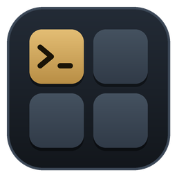

# DevDeck

### Your everyday developer commands, one click away — no terminal hunting.

DevDeck is a free desktop app that keeps the commands and scripts you run every day on a deck of
buttons. Click one and it runs, with its output streaming live in the window. Around the deck sit
the tools developers reach for all day: an HTTP client, a view of what is listening on your ports,
automation that runs commands for you, a clipboard history, a text toolbox, a memory and CPU
monitor, and an AI assistant that can work with **your own local model**.

<br />

[](https://dotnet.microsoft.com/)
[](https://learn.microsoft.com/dotnet/csharp/)
[](https://avaloniaui.net/)
[](https://github.com/CommunityToolkit/dotnet)
[](#assistant)
[](#where-your-data-lives)
<br />
[](#download)
[](tests/DevDeck.Core.Tests)
[](https://github.com/thiagodebona-ui/DevDeck/releases/latest)
[](LICENSE)

</div>

Everything runs on your machine. Nothing you type, paste or run is sent anywhere unless you point
the Assistant or the HTTP client at a server yourself.

**[⬇ Download for Windows](https://github.com/thiagodebona-ui/DevDeck/releases/latest/download/DevDeck-win-x64.zip)**
· [macOS and Linux](#download)

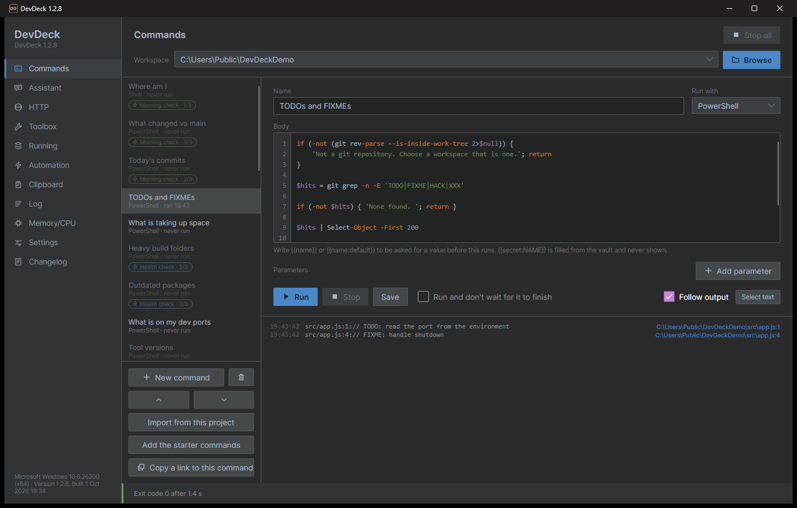

---

## Contents

- [Download](#download) · [Getting started](#getting-started)
- [Features at a glance](#features-at-a-glance)
- [Commands](#commands) · [Automation](#automation) · [HTTP](#http) · [Running](#running) ·
  [Toolbox](#toolbox) · [Clipboard](#clipboard) · [Assistant](#assistant) ·
  [Memory/CPU](#memorycpu) · [Log](#log) · [Settings](#settings) · [Changelog](#changelog)
- [Reaching DevDeck from anywhere](#reaching-devdeck-from-anywhere)
- [Where your data lives](#where-your-data-lives)
- [Building from source](#building-from-source)
- [License](#license)

---

## Download

Every download is **standalone**: no installer, and **no need to install .NET**. Everything the
app needs is inside the folder.

| Platform | Download | |
|---|---|---|
| **Windows** (10 / 11, 64-bit) | [**DevDeck-win-x64.zip**](https://github.com/thiagodebona-ui/DevDeck/releases/latest/download/DevDeck-win-x64.zip) | Recommended |
| macOS, Apple Silicon (M1 and later) | [DevDeck-osx-arm64.tar.gz](https://github.com/thiagodebona-ui/DevDeck/releases/latest/download/DevDeck-osx-arm64.tar.gz) | Preview |
| macOS, Intel | [DevDeck-osx-x64.tar.gz](https://github.com/thiagodebona-ui/DevDeck/releases/latest/download/DevDeck-osx-x64.tar.gz) | Preview |
| Linux, x64 | [DevDeck-linux-x64.tar.gz](https://github.com/thiagodebona-ui/DevDeck/releases/latest/download/DevDeck-linux-x64.tar.gz) | Preview |
| Linux, ARM64 | [DevDeck-linux-arm64.tar.gz](https://github.com/thiagodebona-ui/DevDeck/releases/latest/download/DevDeck-linux-arm64.tar.gz) | Preview |

These links always point at the newest version. Older versions are on the
[Releases](https://github.com/thiagodebona-ui/DevDeck/releases) page.

**Windows is the tested platform.** The macOS and Linux builds come from the same code but have
not been tried on real machines yet. Some features, such as the global hotkey and memory cleanup,
are Windows-only.

## Getting started

### Windows

1. Download **DevDeck-win-x64.zip** and **unzip it anywhere**: your Desktop, `C:\Tools`, a USB
   stick.
2. Open the `DevDeck` folder and run **`DevDeck.exe`**. Next to it is a `lib` folder holding the
   app itself; leave it where it is.
3. Windows may show *"Windows protected your PC"* the first time, because the app is not
   code-signed. Click **More info → Run anyway**.

> The very first launch of a freshly downloaded copy can take several seconds while Windows
> scans the new files. After that it opens in about two seconds.

### macOS (preview)

```sh
tar -xzf DevDeck-osx-arm64.tar.gz          # or DevDeck-osx-x64.tar.gz on an Intel Mac
xattr -dr com.apple.quarantine DevDeck     # the app is not notarised, so macOS blocks it otherwise
./DevDeck/DevDeck
```

### Linux (preview)

```sh
tar -xzf DevDeck-linux-x64.tar.gz          # or DevDeck-linux-arm64.tar.gz
./DevDeck/DevDeck
```

It needs a desktop session (X11, or XWayland) and the usual libraries most desktops already
have: `libfontconfig`, `libICU` and `libX11`.

### First run

On its first run DevDeck fills the deck with a set of **starter commands**, **three example chains**
and **one file watch** so there is something to click straight away. Pick a folder as your
**workspace** at the top of the Commands page and the commands run there.

---

## Features at a glance

| Page | What it is for |
|---|---|
| **Commands** | Your deck: save commands and scripts, run them with one click, watch the output live. |
| **Automation** | Run several commands in a row (chains), or run one automatically when files change. |
| **HTTP** | A lightweight API client with environments, saved requests and curl import. |
| **Running** | What is listening on which port, your containers, health checks, and the heaviest processes. |
| **Toolbox** | Offline text tools: JSON/XML formatting, Base64, URL, JWT, hashes, UUIDs, regex and more. |
| **Clipboard** | An opt-in history of what you copied, searchable, with pinning. |
| **Assistant** | Chat with a local model (Ollama, LM Studio) or any OpenAI-compatible service. |
| **Memory/CPU** | Live gauges for memory, CPU, disk and GPU, plus one-click memory cleanup. |
| **Log** | Everything DevDeck itself did this session, for when something needs explaining. |
| **Settings** | Theme, language, keep-awake, notifications, hotkey and more. |

---

## Commands


The heart of DevDeck. Each command is a saved script with a name. Select it, press **Run**, and its
output streams into the pane below with the exit code and run time in the status bar.

- **Any kind of script.** Choose how each command runs: **PowerShell**, **Command Prompt (batch)**
  or **Shell**. The body gets syntax colouring as you type.
- **Workspace.** The folder at the top is where commands run. Switch projects by picking another
  folder; recent ones are remembered in the drop-down.
- **Parameters on every run.** Add a row under **Parameters** (a name and a value) and it is passed
  to the script each time: PowerShell gets `-Name "value"`, read with `param([string]$Name)` on the
  script's first line; batch gets `%1 %2`; shell scripts `$1 $2`. Every value is also in the
  environment as `DEVDECK_ARG_NAME`.
- **Parameters that ask you.** Write `{{branch}}` in a command and DevDeck asks for a value each
  time it runs. `{{branch:main}}` offers `main` as the default, and values you have typed before are
  offered back.
- **Secrets that never show.** Write `{{secret:API_TOKEN}}` and the value is filled in from
  DevDeck's encrypted vault at run time. It never appears in the command or the settings file.
- **Readable output.** Colours from tools that print them are shown as colours, not escape codes.
  A compiler error such as `Program.cs:42` becomes a link that opens the file at that line in
  your editor.
- **Stop, or don't wait.** Stop a run at any time, or tick *Run and don't wait* for things like dev
  servers that keep going. **Stop all** ends everything the deck started.
- **Run history.** Every run is kept, so you can see what a command printed last time and how long
  it usually takes ("usually 4.7 s" in the status bar).
- **A deck per project.** Put a `.devdeck.json` file in a repository and **Import from this project**
  loads its commands, so a team can share one deck through source control.
- **Quick run with Ctrl+K.** Press **Ctrl+K** (or **Ctrl+P**), type a few letters of a command
  name, press Enter.
- **Copy a link to this command.** Gives you a `devdeck://` link that runs the command from a
  browser bookmark, a document or a chat message.

**Starter commands** include *Where am I*, *What changed vs main*, *Today's commits*,
*TODOs and FIXMEs*, *What is taking up space*, *Heavy build folders*, *Outdated packages*,
*What is on my dev ports*, *Tool versions* and *Open in VS Code*. Edit or delete them freely. If you
ever want them back, **Add the starter commands** restores them.

**Examples** show the mechanics on things too small to get in the way: *Example: hello with a
parameter*, *Example: ask before running*, *Example: write to the log*, *Example: count files*,
*Example: double it* and more, each commented line by line. They all start with `Example:`, so they
are easy to find and to delete once you have what you need.

---

## Automation

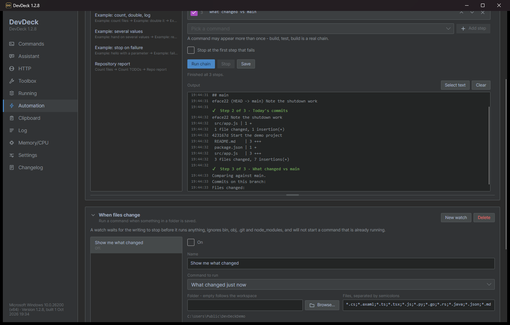

Everything that runs a command without you pressing Run.

### Chains

A chain runs several commands **one after another**, each step waiting for the one before it.
*Morning check* runs *Where am I*, then *Today's commits*, then *What changed vs main*.

- Build a chain by picking commands from your deck. Reorder steps with the arrows; the same command
  may appear twice (build, test, build is a real chain).
- **Stop at the first step that fails**, or keep going so every step gets its answer.
- All the steps' output lands in one log on the page, under a heading for each step with its exit
  code.
- Several chains can run at the same time, each with its own **Stop**.
- **Drag the grip** under the chains section to make it as tall or as short as you like.
- **Steps can pass values along.** Each step receives the previous step's result as environment
  variables: `DEVDECK_PREVIOUS_LINE` (its last line), `DEVDECK_PREVIOUS` (everything it printed),
  `DEVDECK_PREVIOUS_EXIT` and more. The example chain *Pass values between steps* shows how: it
  finds a file, measures it, and reports what it was given.
- **Example chains** to copy from: *Example: log a message* (hand a file path to the next step),
  *Example: count, double, log* (a number changing as it travels, then logged), *Example: several
  values* (pass many values as `NAME=value` lines) and *Example: stop on failure* (the last step never
  runs). A step can use its own parameters too: in a chain, the examples prefer what they were handed
  and fall back to their parameter rows when run by hand.

### When files change

A **watch** runs a command whenever something in a folder is saved. For example, run the tests
every time a `.cs` file changes.

- Choose the folder (or leave it empty to follow the workspace), the file patterns such as
  `*.cs;*.ts`, and the command to run.
- DevDeck waits for the writing to stop before running anything, ignores `bin`, `obj`, `.git` and
  `node_modules`, and never starts a command that is already running.
- The command is told what changed through `DEVDECK_*` environment variables. The starter command
  *What changed just now* prints them all, so you can see what you get.
- Watches arrive switched **off**; turn one on when you are ready.

---

## HTTP

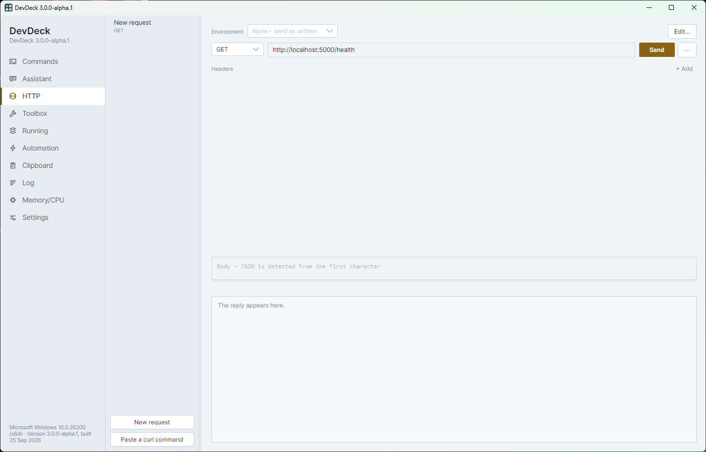

A small, fast API client built into the deck.

- **Send any request** with method, URL, headers and body. JSON bodies are recognised from the
  first character.
- **Paste a curl command.** Copy a request as curl from your browser's developer tools and paste
  it, either with the button or straight into the address bar with Ctrl+V. The method, headers and
  body are filled in for you.
- **Readable replies.** JSON and XML come back indented and coloured, HTML is left as the server
  sent it, and binary responses say what they are and how big instead of filling the screen.
- **Environments.** Keep sets of values such as `{{host}}` and `{{token}}` for *Local*, *Dev* and
  *Prod*, and switch between them from the picker. Write a request once and send it anywhere.
  Values marked secret are stored in the encrypted vault.
- **Saved requests** can be renamed, filed into collapsible groups, and flagged with a colour so
  staging and production are easy to tell apart.
- **Resizable panes.** Drag the headers, body and reply panes to the split you like; it is
  remembered.

---

## Running

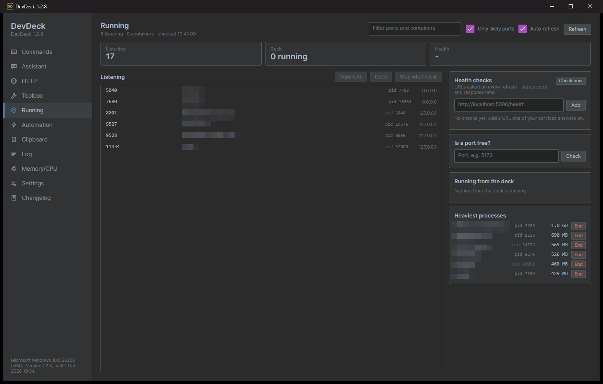

What is going on on your machine right now.

- **Listening ports** with the program behind each one. Select a row to **copy its URL**,
  **open it** in the browser, or **stop what has it** when an old dev server is holding your port.
  *Only likely ports* hides the system noise.
- **Containers** from Docker or Podman, when one is installed.
- **Health checks.** Add URLs such as `http://localhost:5000/health`; each is checked on every
  refresh with its status code and response time.
- **Is a port free?** Type a port and find out before you start a server on it.
- **Running from the deck** lists every command DevDeck is running at the moment.
- **Heaviest processes**, with an **End** button for the one that is eating your memory.

---

## Toolbox

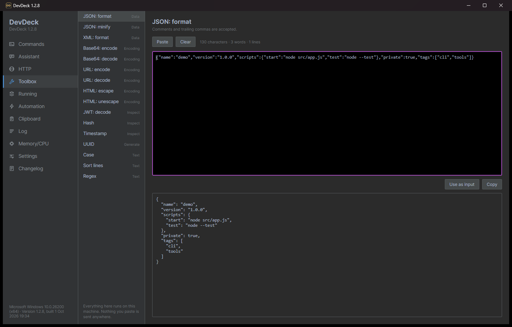

The little conversions you would otherwise search the web for, all offline. Nothing you paste
leaves your machine.

| Data | Encoding | Inspect | Generate & text |
|---|---|---|---|
| JSON format | Base64 encode / decode | JWT decode | UUID |
| JSON minify | URL encode / decode | Hash | Case conversion |
| XML format | HTML escape / unescape | Timestamp | Sort lines |
| | | | Regex tester |

Paste into the top box, read the result below, then **Copy** it, or use **Use as input** to chain
one tool into the next.

---

## Clipboard

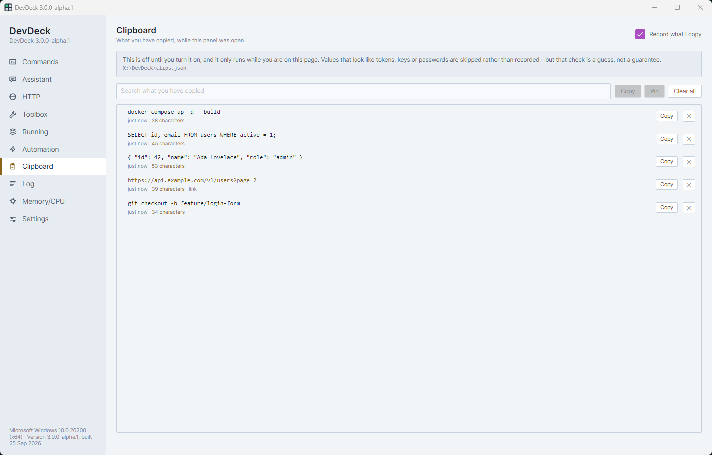

A history of what you copied, so the command you copied an hour ago is still there.

- **Off until you turn it on** with *Record what I copy*, and it only records while the Clipboard
  page is open.
- Values that look like **tokens, keys or passwords are skipped** rather than recorded (a best
  guess, not a guarantee).
- **Search** the history, **Copy** an entry back, **Pin** the ones you keep reaching for, and
  **Clear all** when you are done. Links are recognised and can be opened.

---

## Assistant

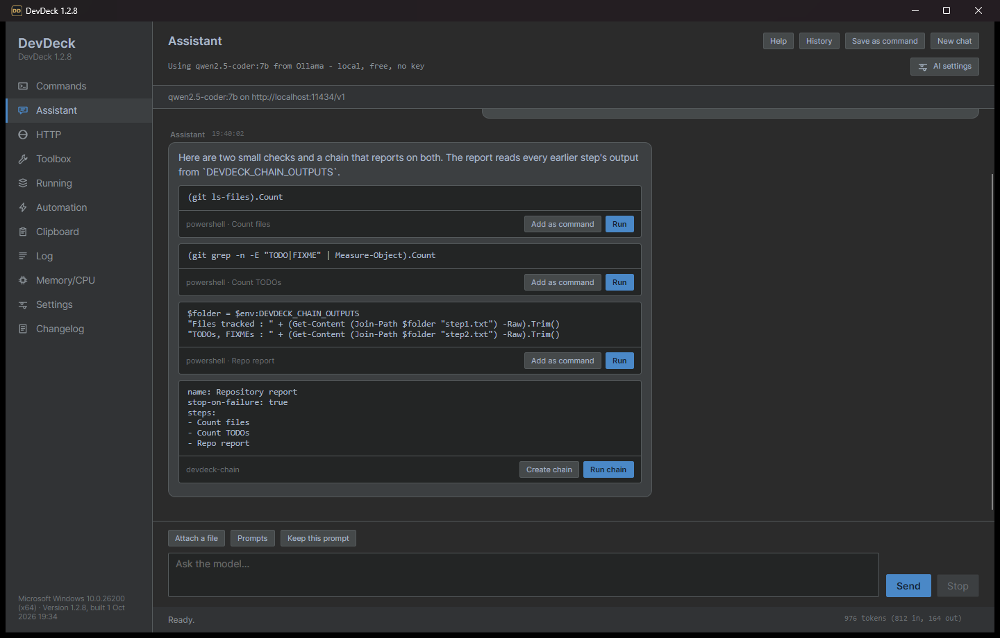

A chat panel for a language model of your choice.

- Works with a **local model through Ollama or LM Studio**, free and private, or any
  **OpenAI-compatible** service with your own key. **Set up Ollama** helps you get a local model
  running.
- It knows which repository you are in, and you can **attach files** (or drag them in) as context.
- Any code it writes comes with a **Run** button, whose output streams back into the conversation,
  and an **Add as command** button that puts it on your deck. It always asks before running
  anything.
- **Prompts** keeps a library of reusable prompts, and **History** reopens earlier conversations.
- The status bar shows the token count, the cost where the price is published, and how full the
  model's context is.

---

## Memory/CPU

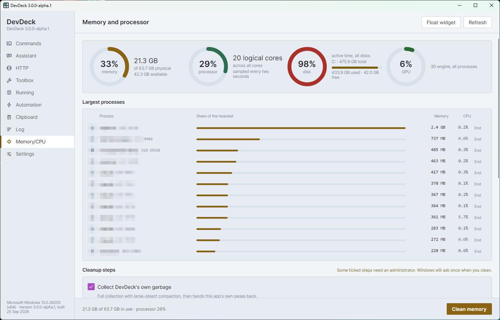

- Live gauges for **memory**, **processor**, **disk** activity and **GPU**.
- **Largest processes** by memory, with their CPU use and an **End** button.
- **Clean memory** runs the cleanup steps you tick: trimming DevDeck's own memory, emptying other
  processes' working sets, flushing the file cache and more. Steps that need administrator rights
  ask Windows once.
- **Float widget** puts a small always-on-top memory gauge on your desktop.

---

## Log

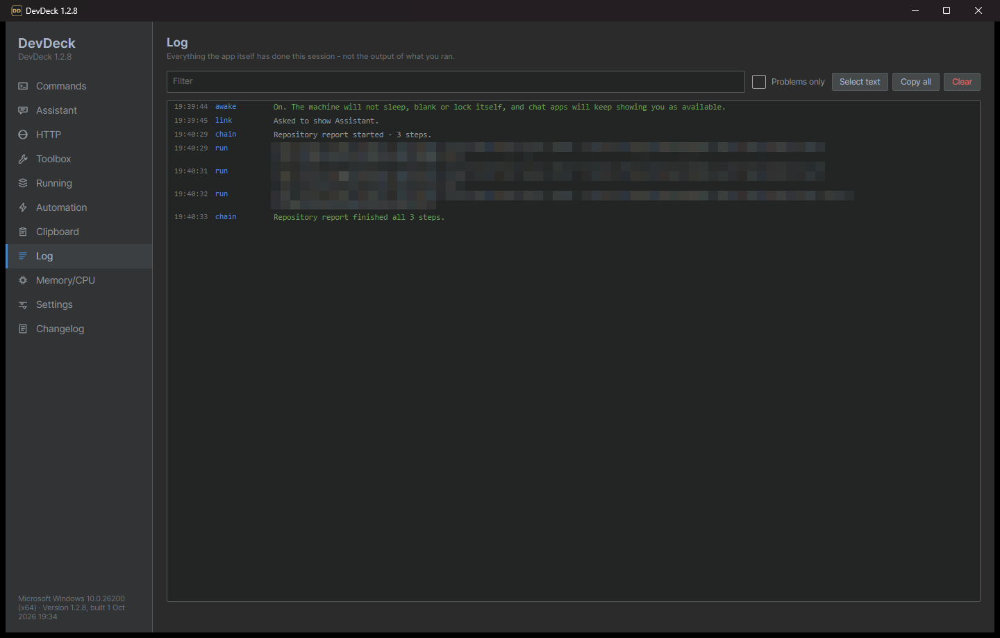

Everything DevDeck itself did this session: links it was asked to open, chains that started and
finished, settings it could not save. It is not the output of your commands, which lives with
each command. Filter it, show *Problems only*, or **Copy all** to paste into a bug report.

---

## Settings

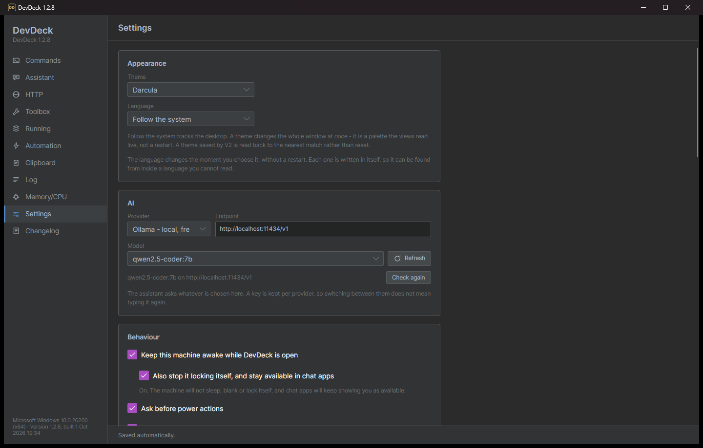

- **Theme** (Steel Light, Steel Dark, or follow Windows) and **language** (English or Brazilian
  Portuguese). Both change instantly, without a restart.
- **Keep this machine awake** while DevDeck is open, and optionally stop it from **locking** and
  keep you shown as **available** in chat apps.
- **Tell me when it is done:** a notification when a long command finishes, for any run over a
  time you choose.
- **Start DevDeck when I sign in**, for your user only. It opens minimised, so it is ready
  without getting in front of anything. Turn it off and the startup entry is removed.
- **Global hotkey** to bring DevDeck to the front from anywhere.
- **Secrets:** add, view the names of, and remove the values used by `{{secret:NAME}}`.
- **Reset everything** to the defaults. Your old settings are kept beside the new ones with a date
  in the name, and DevDeck restarts itself on the fresh settings.

## Changelog

The **Changelog** page, at the bottom of the rail, lists what every version brought. It is built
into the app, so it works offline. The first time a new version starts, DevDeck opens on this page
once. **Check for newer versions** adds what is in any release you have not installed yet, with a
link to download it. The same notes are in [CHANGELOG.md](CHANGELOG.md).

---

## Reaching DevDeck from anywhere

- **Tray icon.** DevDeck lives in the notification area, with your most-used commands on its menu.
- **Global hotkey.** Set one in Settings to bring the window up from any app.
- **`devdeck` in the terminal.** Settings can add a small `devdeck` command, so
  `devdeck run "Tool versions"` runs a command in the app from any terminal.
- **`devdeck://` links.** `devdeck://run/<command>`, `devdeck://chain/<chain>` and
  `devdeck://show/<page>` work from a browser, a wiki page or a chat message.
- **One window.** Starting DevDeck again, or clicking a link, brings the open window forward
  instead of starting a second copy.

---

## Where your data lives

DevDeck is **portable**: it keeps its files next to `DevDeck.exe`, so copying the folder takes
your whole deck with it.

| File | What is in it |
|---|---|
| `settings.json` | Your commands, chains, watches, requests, environments and preferences. |
| `secrets.json` | Secret values, **encrypted** with your Windows account (DPAPI). They can only be read by you, on this machine. |
| `history.json` | Past runs of each command. |
| `clips.json` | Clipboard history, if you turned it on. |
| `conversations/` | Saved Assistant conversations. |

To start over, use **Settings → Reset everything**, or delete `settings.json` while DevDeck is
closed. If the folder is somewhere you cannot write to, DevDeck uses `%APPDATA%\DevDeck` instead.

On macOS the files live in `~/Library/Application Support/DevDeck`, and on Linux in
`~/.config/devdeck`.

---

## Building from source

You need the [.NET 8 SDK](https://dotnet.microsoft.com/download) (or newer) and Python 3 if you
change any user-visible text.

```sh
dotnet build src/DevDeck.App                  # build
dotnet run --project src/DevDeck.App          # run it
dotnet test tests/DevDeck.Core.Tests          # run the tests

# A self-contained Windows build in publish/win-x64: DevDeck.exe plus lib/
dotnet publish src/DevDeck.App -c Release -r win-x64 --self-contained -o publish/win-x64
```

**Project layout**

```
src/DevDeck.Core/        everything that is not UI: running commands, settings, HTTP, tools
src/DevDeck.App/         the Avalonia desktop app: windows, pages and view models
tests/DevDeck.Core.Tests the test suite
gen.py                   the English / Portuguese string table; run it after editing text
```

Every piece of text the app shows is a row in `gen.py`, in English and Brazilian Portuguese.
Run `python gen.py` after changing one; it regenerates the string files and fails if a key is
missing.

DevDeck is built with [Avalonia](https://avaloniaui.net/) and
[CommunityToolkit.Mvvm](https://github.com/CommunityToolkit/dotnet).

**Making a release.** Push a version tag and GitHub Actions builds every platform and publishes
the downloads (see `.github/workflows/release.yml`):

```sh
git tag v1.0.1
git push origin v1.0.1
```

---

## License

DevDeck is **free to use, modify and share**, under the [MIT license with the Commons Clause](LICENSE).

- ✅ Use it at home or at work, for any project.
- ✅ Change it, fork it, and share your version, as long as the license comes with it.
- ❌ You may not **sell** DevDeck, or sell a product or service whose value comes mainly from it.

Because of that last condition, DevDeck is *source-available* rather than open source in the
strict OSI sense.
