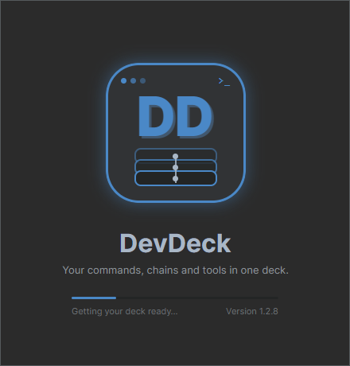
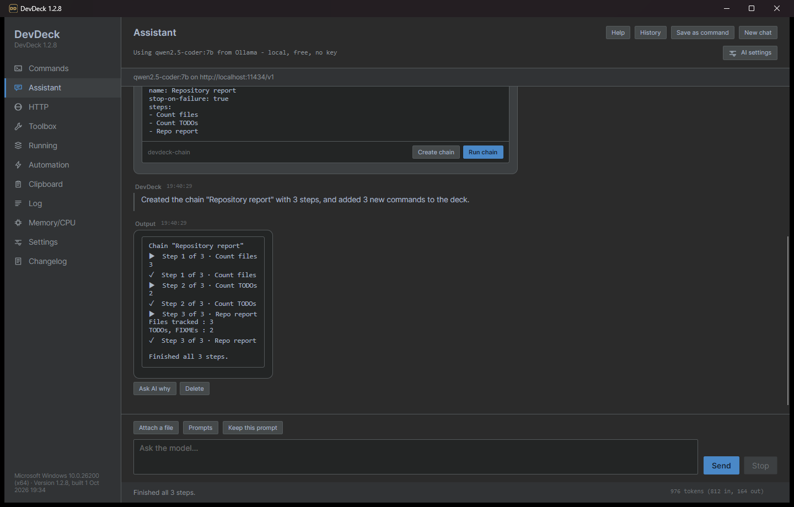
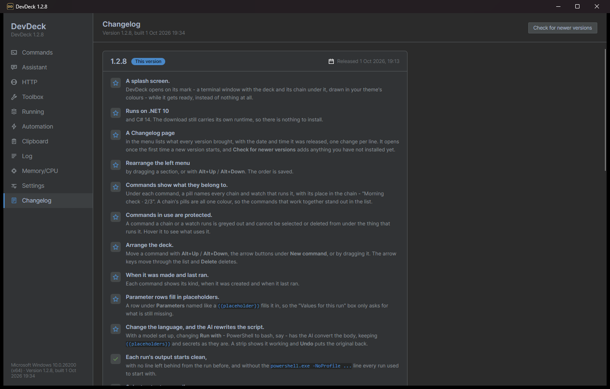

<div align="center">



# DevDeck

### Your everyday developer commands, one click away — no terminal hunting.

DevDeck is a free desktop app that keeps the commands and scripts you run every day on a deck of
buttons. Click one and it runs, with its output streaming live in the window. Chain commands
together, run them when files change, and let an AI assistant write, convert and explain them -
with **your own local model** if you like. Around the deck sit the tools developers reach for all
day: an HTTP client, a view of your ports and containers, a clipboard history, a text toolbox and
a memory and CPU monitor.

<br />

[](https://dotnet.microsoft.com/)
[](https://learn.microsoft.com/dotnet/csharp/)
[](https://avaloniaui.net/)
[](https://github.com/CommunityToolkit/dotnet)
[](#assistant)
[](#where-your-data-lives)
<br />
[](#download)
[](tests/DevDeck.Core.Tests)
[](https://github.com/thiagodebona-ui/DevDeck/releases/latest)
[](LICENSE)

</div>

Everything runs on your machine. Nothing you type, paste or run is sent anywhere unless you point
the Assistant or the HTTP client at a server yourself.

**[⬇ Download for Windows](https://github.com/thiagodebona-ui/DevDeck/releases/latest/download/DevDeck-win-x64.zip)**
· [macOS and Linux](#download)


---

## Contents

- [Download](#download) · [Getting started](#getting-started)
- [Features at a glance](#features-at-a-glance)
- [Commands](#commands) · [Automation](#automation) · [Assistant](#assistant) · [HTTP](#http) ·
  [Running](#running) · [Toolbox](#toolbox) · [Clipboard](#clipboard) · [Screenshots](#screenshots) ·
  [Memory/CPU](#memorycpu) · [Log](#log) · [Settings](#settings) · [Changelog](#changelog)
- [Reaching DevDeck from anywhere](#reaching-devdeck-from-anywhere)
- [Where your data lives](#where-your-data-lives)
- [Building from source](#building-from-source)
- [License](#license)

---

## Download

Every download is **standalone**: no installer, and **no need to install .NET**. Everything the
app needs is inside the folder.

| Platform | Download | |
|---|---|---|
| **Windows** (10 / 11, 64-bit) | [**DevDeck-win-x64.zip**](https://github.com/thiagodebona-ui/DevDeck/releases/latest/download/DevDeck-win-x64.zip) | Recommended |
| macOS, Apple Silicon (M1 and later) | [DevDeck-osx-arm64.tar.gz](https://github.com/thiagodebona-ui/DevDeck/releases/latest/download/DevDeck-osx-arm64.tar.gz) | Preview |
| macOS, Intel | [DevDeck-osx-x64.tar.gz](https://github.com/thiagodebona-ui/DevDeck/releases/latest/download/DevDeck-osx-x64.tar.gz) | Preview |
| Linux, x64 | [DevDeck-linux-x64.tar.gz](https://github.com/thiagodebona-ui/DevDeck/releases/latest/download/DevDeck-linux-x64.tar.gz) | Preview |
| Linux, ARM64 | [DevDeck-linux-arm64.tar.gz](https://github.com/thiagodebona-ui/DevDeck/releases/latest/download/DevDeck-linux-arm64.tar.gz) | Preview |

These links always point at the newest version. All releases are on the
[Releases](https://github.com/thiagodebona-ui/DevDeck/releases) page.

**Windows is the tested platform.** The macOS and Linux builds come from the same code but have
not been tried on real machines yet. Some features, such as the global hotkey, batch scripts and
memory cleanup, are Windows-only.

## Getting started

### Windows

1. Download **DevDeck-win-x64.zip** and **unzip it anywhere**: your Desktop, `C:\Tools`, a USB
   stick.
2. Open the `DevDeck` folder and run **`DevDeck.exe`**. Next to it is a `lib` folder holding the
   app itself; leave it where it is.
3. Windows may show *"Windows protected your PC"* the first time, because the app is not
   code-signed yet. Click **More info → Run anyway**.

DevDeck opens on a short splash screen while it gets your deck ready.

> The very first launch of a freshly downloaded copy can take several seconds while Windows
> scans the new files. After that it opens in about two seconds.

### macOS (preview)

```sh
tar -xzf DevDeck-osx-arm64.tar.gz          # or DevDeck-osx-x64.tar.gz on an Intel Mac
xattr -dr com.apple.quarantine DevDeck     # the app is not notarised, so macOS blocks it otherwise
./DevDeck/DevDeck
```

### Linux (preview)

```sh
tar -xzf DevDeck-linux-x64.tar.gz          # or DevDeck-linux-arm64.tar.gz
./DevDeck/DevDeck
```

It needs a desktop session (X11, or XWayland) and the usual libraries most desktops already
have: `libfontconfig`, `libICU` and `libX11`.

### First run

On its first run DevDeck fills the deck with **starter commands**, **starter chains** such as
*Morning check*, a **file watch**, and a set of small **examples**, so there is something to click
straight away. Pick a folder as your **workspace** at the top of the Commands page and the
commands run there.

---

## Features at a glance

| Page | What it is for |
|---|---|
| **Commands** | Your deck: save commands and scripts, run them with one click, watch the output live. |
| **Assistant** | Chat with a local model (Ollama, LM Studio) or any OpenAI-compatible service; it writes commands and whole chains for you. |
| **Automation** | Run several commands in a row (chains), or run one automatically when files change. |
| **HTTP** | A lightweight API client with environments, saved requests and curl import. |
| **Running** | What is listening on which port, your containers, health checks, and the heaviest processes. |
| **Toolbox** | Offline text tools: JSON/XML formatting, Base64, URL, JWT, hashes, UUIDs, regex and more. |
| **Clipboard** | An opt-in history of what you copied, searchable, with pinning. |
| **Screenshots** | Every Win+Shift+S capture in one gallery: thumbnails, list or details, favourites, multi-select copy and drag. |
| **Memory/CPU** | Live gauges for memory, CPU, disk and GPU, plus one-click memory cleanup. |
| **Log** | Everything DevDeck itself did this session, for when something needs explaining. |
| **Settings** | Theme, language, AI, keep-awake, notifications, hotkey and more. |
| **Changelog** | What every version brought, and when it came out. |

The menu on the left is yours to arrange: drag a section, or use **Alt+Up** / **Alt+Down**. Above
the version at its foot, a line shows what DevDeck and every command it started are using right
now - memory, CPU and disk - so a build that is eating the machine is easy to spot.

---

## Commands

<details>
<summary><b>📸 Screenshot</b> - Commands</summary>


</details>

The heart of DevDeck. Each command is a saved script with a name. Select it, press **Run**, and its
output streams into the pane below. While it runs the status bar counts up - *Running for 3m 07s* -
and when it ends it shows the exit code and how long it took.

### Writing a command

- **Any kind of script.** Choose how each command runs with **Run with**: **PowerShell**,
  **Batch** (Command Prompt), **Bash** (Git Bash or WSL on Windows) or a single **Shell** line. The
  body gets syntax colouring as you type.
- **Change the language, keep the script.** With a model set up in **Settings > AI**, changing
  **Run with** - PowerShell to bash, say - has the AI rewrite the body for the new language. A strip
  under the body shows it working, **Run** waits for it, and **Undo** puts the original back.
- **Workspace.** The folder at the top is where commands run. Switch projects by picking another
  folder; recent ones are remembered in the drop-down.

### Parameters and secrets

- **Parameters on every run.** Add a row under **Parameters** (a name and a value) and it is passed
  to the script each time: PowerShell gets `-Name "value"`, read with `param([string]$Name)` on the
  script's first line; batch gets `%1 %2`; bash and shell `$1 $2`. Every value is also in the
  environment as `DEVDECK_ARG_NAME`.
- **Parameters that ask you.** Write `{{branch}}` in a command and DevDeck asks for a value each time
  it runs. `{{branch:main}}` offers `main` as the default, and values you have typed before are
  offered back. A parameter row with the same name fills it in, so only what is still missing is
  asked for.
- **Secrets that never show.** Write `{{secret:API_TOKEN}}` and the value is filled in from
  DevDeck's encrypted vault at run time. It never appears in the command or the settings file.

### Running and reading output

- **Readable output.** Colours from tools that print them are shown as colours, not escape codes. A
  compiler error such as `Program.cs:42` becomes a link that opens the file at that line in your
  editor. Every run starts on a clean pane, and even a command that prints without pause keeps
  the window responsive.
- **Select text** shows the output as plain text, so you can select across lines and copy just the
  part you want.
- **Stop, or don't wait.** Stop a run at any time, or tick *Run and don't wait* for things like dev
  servers that keep going. **Stop all** ends everything the deck started.
- **Explain this failure** sends a failed run, with its output, to the Assistant.
- **Run history.** Every run is kept, so you can see how long a command usually takes ("usually
  4.7 s" in the status bar).

### The list of commands

- **See what belongs together.** Under each command, a pill names every chain and watch that runs
  it, with its place in the chain - *Morning check · 2/3*. A chain's pills share one colour, so the
  commands that work together stand out.
- **Commands in use are protected.** A command a chain or a watch runs is greyed out and cannot be
  selected or deleted from under it; hover it to see what uses it.
- **Arrange it your way.** The arrow keys move through the list, **Alt+Up** / **Alt+Down**, the arrow
  buttons or dragging reorder it, and **Delete** deletes the selected command.
- **When it was made and last ran** is shown under each name.
- **Quick run with Ctrl+K.** Press **Ctrl+K** (or **Ctrl+P**), type a few letters of a command
  name, press Enter.
- **Copy a link to this command.** Gives you a `devdeck://` link that runs the command from a
  browser bookmark, a document or a chat message.
- **A deck per project.** Put a `.devdeck.json` file in a repository and **Import from this project**
  loads its commands, so a team can share one deck through source control.

**Starter commands** include *Where am I*, *What changed vs main*, *Today's commits*,
*TODOs and FIXMEs*, *What is taking up space*, *Heavy build folders*, *Outdated packages*,
*What is on my dev ports*, *Tool versions* and *Open in VS Code*. Edit or delete them freely;
**Add the starter commands** brings back any you miss.

**Examples** show the mechanics on things too small to get in the way: *Example: hello with a
parameter*, *Example: ask before running*, *Example: write to the log*, *Example: count files*,
*Example: double it* and more, each commented line by line. They all start with `Example:`, so they
are easy to find and to delete once you have what you need.

---

## Automation

<details>
<summary><b>📸 Screenshot</b> - Automation</summary>


</details>

Everything that runs a command without you pressing Run.

### Chains

A chain runs several commands **one after another**, each step waiting for the one before it.
*Morning check* runs *Where am I*, then *Today's commits*, then *What changed vs main*.

- **Build a chain** by picking commands from your deck, or ask the [Assistant](#assistant) to write
  one. Reorder steps with the arrows; the same command may appear twice (build, test, build is a
  real chain).
- **Switch a step off** by unticking it: it stays in the chain, in its place, and is skipped when the
  chain runs.
- **Stop at the first step that fails**, or keep going so every step gets its answer.
- **One log for the whole chain.** Each step's heading shows how it went - ▶ running, ✓ passed,
  ✗ failed with its exit code, ■ stopped, ○ switched off - with its output under it.
- Several chains can run at the same time, each with its own **Stop**. **Drag the grip** under the
  chains section to make it as tall or as short as you like.

**Steps can pass values along.** Each step is given what came before it as environment variables:

| Variable | What it holds |
|---|---|
| `DEVDECK_PREVIOUS` | Everything the step just before printed. |
| `DEVDECK_PREVIOUS_LINE` | The last line it printed - the one value a step written to feed another ends on. |
| `DEVDECK_PREVIOUS_EXIT` | Its exit code, `0` for success. |
| `DEVDECK_CHAIN_OUTPUTS` | A folder with **every** earlier step's output, as `step1.txt`, `step2.txt`, ... - for a final step that reports on several. |
| `DEVDECK_STEP`, `DEVDECK_STEPS`, `DEVDECK_CHAIN` | Where this step is, and in which chain. |

The example chains show each way of doing it: *Example: log a message* hands a file path to the next
step, *Example: count, double, log* passes a number along, *Example: several values* passes many as
`NAME=value` lines, and *Example: stop on failure* shows a chain stopping.

### When files change

A **watch** runs a command whenever something in a folder is saved. For example, run the tests
every time a `.cs` file changes.

- Choose the folder (or leave it empty to follow the workspace), the file patterns such as
  `*.cs;*.ts`, and the command to run.
- DevDeck waits for the writing to stop before running anything, ignores `bin`, `obj`, `.git` and
  `node_modules`, and never starts a command that is already running.
- The command is told what changed through `DEVDECK_CHANGED_*` environment variables. The starter
  command *What changed just now* prints them all, so you can see what you get.
- Watches arrive switched **off**; turn one on when you are ready.

---

## Assistant

<details>
<summary><b>📸 Screenshot</b> - Assistant</summary>




</details>

A chat panel for a language model of your choice, built to work with your deck.

- **Your model.** A **local model through Ollama or LM Studio** - free and private - or any
  **OpenAI-compatible** service with your own key. Choose it under **Settings > AI**; **Set up
  Ollama** helps you get a local model running.
- **It writes commands.** Code it writes comes with **Run**, whose output streams back into the
  conversation, and **Add as command**, which puts it on your deck. It always asks before running
  anything.
- **It builds chains.** Ask for several commands that work together and a chain to run them -
  *"make three commands that check this repo, and a chain that writes a report from their output"*.
  **Create chain** adds the commands to your deck and the chain to Automation; **Run chain** runs it
  right in the conversation. Your own commands are never overwritten.
- **Ask AI why.** Under any output in the chat, **Ask AI why** sends the model what ran and what it
  printed and asks why it behaved that way. **Delete** takes the output out of the conversation.
- **Context.** It knows which workspace you are in, and you can **attach files** (or drag them in).
- **Help** lists what it can do, with an example prompt for each that you can click to try, and
  tips for getting good answers. **Prompts** keeps the ones you reuse, and **History** reopens
  earlier conversations.
- **New chat** puts the conversation away in History and starts an empty one; **Clear chat**
  empties it without keeping it, stopping anything still running. **Delete a single message** with
  the × beside its time, or from its right-click menu - the model will not see it again.
- The status bar shows the token count, the cost where the price is published, and how full the
  model's context is.

---

## HTTP

<details>
<summary><b>📸 Screenshot</b> - HTTP</summary>


</details>

A small, fast API client built into the deck.

- **Send any request** with method, URL, headers and body. JSON bodies are recognised from the
  first character.
- **Paste a curl command.** Copy a request as curl from your browser's developer tools and paste
  it, either with the button or straight into the address bar with Ctrl+V. The method, headers and
  body are filled in for you.
- **Readable replies, of any size.** JSON and XML come back indented and coloured. Only the lines on
  screen are drawn, so a reply of several megabytes scrolls as smoothly as a short one.
- **Parsed or Source.** A JSON reply opens as a tree: **Up** and **Down** walk it, **Right** opens a
  node and **Left** closes it. Other replies are drawn under **Preview**: images (PNG, JPEG, GIF,
  WebP, BMP, ICO), **SVG**, the pages of a **PDF**, the text of an **HTML** page, **Markdown**, and
  **CSV** as a table. **Source** shows what arrived - formatted text, or a hex dump for a file.
- **Open** hands the reply to the app your system uses for it: a browser, a PDF viewer, a player.
- **Save names the file for you**, from the server's suggested file name or from the content type:
  an `image/png` saves as `.png`. A server that labels everything `application/octet-stream` is
  read from the first bytes instead.
- **Environments.** Keep sets of values such as `{{host}}` and `{{token}}` for *Local*, *Dev* and
  *Prod*, and switch between them from the picker. Values marked secret are stored in the
  encrypted vault.
- **Saved requests** can be renamed, filed into collapsible groups, and flagged with a colour so
  staging and production are easy to tell apart. **Drag** a request to reorder it, or onto a group
  to file it there; **Alt+Up** / **Alt+Down** move the selected one.
- **Send from the list.** The ▶ beside each saved request sends it straight away. Requests run in
  parallel, each keeping its own reply - select a request to see what it got.
- **Run a whole group.** The ▷ on a group header sends every request in the group at once - a quick
  smoke test of an API - and becomes a ■ that cancels whatever is still out. A line under the list
  says how many answered.
- **Resizable panes.** Drag the headers, body and reply panes to the split you like; it is
  remembered. On a narrow window the reply's buttons move under its status line rather than off
  the edge.

---

## Running

<details>
<summary><b>📸 Screenshot</b> - Running</summary>


</details>

What is going on on your machine right now.

- **Listening ports** with the program behind each one. Select a row to **copy its URL**,
  **open it** in the browser, or **stop what has it** when an old dev server is holding your port.
  *Only likely ports* hides the system noise.
- **Containers** from Docker or Podman, when one is installed.
- **Health checks.** Add URLs such as `http://localhost:5000/health`; each is checked on every
  refresh with its status code and response time.
- **Is a port free?** Type a port and find out before you start a server on it.
- **Running from the deck** lists every command DevDeck is running at the moment.
- **Heaviest processes**, with an **End** button for the one that is eating your memory.

---

## Toolbox

<details>
<summary><b>📸 Screenshot</b> - Toolbox</summary>


</details>

The little conversions you would otherwise search the web for, all offline. Nothing you paste
leaves your machine.

| Data | Encoding | Inspect | Generate & text |
|---|---|---|---|
| JSON format | Base64 encode / decode | JWT decode | UUID |
| JSON minify | URL encode / decode | Hash | Case conversion |
| XML format | HTML escape / unescape | Timestamp | Sort lines |
| | | | Regex tester |

Paste into the top box, read the result below, then **Copy** it, or use **Use as input** to chain
one tool into the next. Each tool keeps its own input, so switching tools never carries text into
one that cannot read it. JSON and XML results are coloured, and the JSON tools - and JWT decode -
can show the result as a **Tree** to walk with the arrow keys.

---

## Clipboard

<details>
<summary><b>📸 Screenshot</b> - Clipboard</summary>


</details>

A history of what you copied, so the command you copied an hour ago is still there.

- **Off until you turn it on** with *Record what I copy*, and it only records while the Clipboard
  page is open.
- Values that look like **tokens, keys or passwords are skipped** rather than recorded (a best
  guess, not a guarantee).
- **Search** the history, **Copy** an entry back, **Pin** the ones you keep reaching for, and
  **Clear all** when you are done. Links are recognised and can be opened.

---

## Screenshots

Every screenshot on the machine, in one place.

- **Win+Shift+S captures appear by themselves.** The page reads the folder Snipping Tool saves to
  (*Pictures\Screenshots*, wherever OneDrive has put it), so a capture taken while DevDeck was
  closed is there too, and a new one lands in the gallery as you take it. If nothing shows up,
  turn on automatic saving in Snipping Tool's settings.
- **Thumbnails, List or Details**, newest first. Details has a column for each fact and scrolls
  sideways on a narrow window. Drag the divider to size the preview; both are remembered.
- **Search** by name or date, **star favourites** and show **Favourites only**.
- **Select several** with Ctrl or Shift. **Copy path** copies every path, one per line; **Copy
  image** copies one picture, or several as files; **Favourite** and **Delete** work on the whole
  selection. Delete sends files to the Recycle Bin.
- **Drag tiles out** into Teams, a Jira comment, a browser upload or a folder - all of the selected
  ones at once. Double-click opens a screenshot; **Show in folder** finds it in Explorer.
- **Also keep images I copy** (off until you turn it on) collects captures that never become a file,
  such as Snipping Tool with automatic saving off or an image copied from a browser. A capture that
  arrives both ways is kept once, and these are cleared after 30 days unless they are favourites.

---

## Memory/CPU

<details>
<summary><b>📸 Screenshot</b> - Memory and CPU</summary>


</details>

- Live gauges for **memory**, **processor**, **disk** activity and **GPU**.
- **Largest processes** by memory, with their CPU use and an **End** button.
- **Clean memory** runs the cleanup steps you tick: trimming DevDeck's own memory, emptying other
  processes' working sets, flushing the file cache and more. Steps that need administrator rights
  ask Windows once.
- **Float widget** puts a small always-on-top memory gauge on your desktop.

---

## Log

<details>
<summary><b>📸 Screenshot</b> - Log</summary>


</details>

Everything DevDeck itself did this session: links it was asked to open, chains that started and
finished, the command line each run was started with, settings it could not save. It is not the
output of your commands, which lives with each command. Filter it, show *Problems only*, select
across lines with **Select text**, or **Copy all** to paste into a bug report.

---

## Settings

<details>
<summary><b>📸 Screenshot</b> - Settings</summary>


</details>

- **Theme** and **language** (English or Brazilian Portuguese). Both change instantly, without a
  restart.
  - Dark: Steel Dark, Midnight, Nord, Gruvbox Dark, Darcula, Solarized Dark and High Contrast.
  - Light: Steel Light, Solarized Light, Paper, One Light, Nord Light and Gruvbox Light.
  - Or follow the system.
- **AI:** the provider, endpoint, model and API key the Assistant uses - and that converts scripts -
  with **Refresh** to list the models the endpoint offers. Saved as you change them; a key is kept
  per provider.
- **Behaviour**, each switch with a tip on hover:
  - **Keep this machine awake** while DevDeck is open, and optionally stop it from **locking** and
    keep you shown as **available** in chat apps.
  - **Start DevDeck when I sign in**, for your user only. It opens minimised, ready on the taskbar
    without getting in front of anything.
  - **Follow output** as it arrives.
- **Tell me when it is done:** a notification when a long command finishes, for any run over a
  time you choose.
- **Global hotkey** to bring DevDeck to the front from anywhere.
- **Secrets:** add, view the names of, and remove the values used by `{{secret:NAME}}`.
- **Environment variables** given to every command.
- **Reset everything** to the defaults. Your old settings are kept beside the new ones with a date
  in the name, and DevDeck restarts itself on the fresh settings.

---

## Changelog

<details>
<summary><b>📸 Screenshot</b> - Changelog</summary>



</details>

The **Changelog** page lists what every version brought - one change per line, with a ✓ for a fix
and a ★ for something new - and the date and time each version was released. It is built into the
app, so it works offline. The first time a new version starts, DevDeck opens on this page once.
**Check for newer versions** adds what is in any release you have not installed yet, with a link to
download it. The same notes are in [CHANGELOG.md](CHANGELOG.md).

---

## Reaching DevDeck from anywhere

- **Tray icon.** DevDeck lives in the notification area, with your most-used commands on its menu.
- **Global hotkey.** Set one in Settings to bring the window up from any app.
- **`devdeck` in the terminal.** Settings can add a small `devdeck` command, so
  `devdeck run "Tool versions"` runs a command in the app from any terminal.
- **`devdeck://` links.** `devdeck://run/<command>`, `devdeck://chain/<chain>` and
  `devdeck://show/<page>` work from a browser, a wiki page or a chat message.
- **One window.** Starting DevDeck again, or clicking a link, brings the open window forward
  instead of starting a second copy.

---

## Where your data lives

DevDeck is **portable**: it keeps its files next to `DevDeck.exe`, so copying the folder takes
your whole deck with it.

| File | What is in it |
|---|---|
| `settings.json` | Your commands, chains, watches, requests, environments and preferences. |
| `secrets.json` | Secret values, **encrypted** with your Windows account (DPAPI). They can only be read by you, on this machine. |
| `history.json` | Past runs of each command. |
| `clips.json` | Clipboard history, if you turned it on. |
| `shots.json` | Which screenshots you starred as favourites. |
| `shots/` | Images kept from the clipboard, if you turned *Also keep images I copy* on. |
| `conversations/` | Saved Assistant conversations. |

To start over, use **Settings → Reset everything**, or delete `settings.json` while DevDeck is
closed. If the folder is somewhere you cannot write to, DevDeck uses `%APPDATA%\DevDeck` instead.

On macOS the files live in `~/Library/Application Support/DevDeck`, and on Linux in
`~/.config/devdeck`.

To update, replace `DevDeck.exe` and the `lib` folder with the ones from the new download and keep
the files above.

---

## Building from source

You need the [.NET 10 SDK](https://dotnet.microsoft.com/download) (or newer), and Python 3 if you
change any user-visible text.

```sh
dotnet build DevDeck.sln -c Release      # build
dotnet run --project src/DevDeck.App              # run it
dotnet test tests/DevDeck.Core.Tests              # run the tests

# A self-contained Windows build in publish/win-x64: DevDeck.exe plus lib/
dotnet publish src/DevDeck.App -c Release -r win-x64 --self-contained -o publish/win-x64
```

**Project layout**

```
src/DevDeck.Core/          everything that is not UI: running commands, chains, settings, HTTP,
                           the AI client and briefing, the changelog, tools
src/DevDeck.App/           the Avalonia desktop app: windows, pages, view models, themes, icons
tests/DevDeck.Core.Tests/  the test suite (run directly; it is not in the solution)
gen.py                     the English / Portuguese string table; run it after editing text
CHANGELOG.md               what each version brought, with its release time
tools/make-icon.ps1        draws the app icon and docs/images/icon.png; run it after changing the mark
```

Every piece of text the app shows is a row in `gen.py`, in English and Brazilian Portuguese.
Run `python gen.py` after changing one; it regenerates the string files and fails if a key is
missing.

DevDeck is built with [Avalonia](https://avaloniaui.net/) and
[CommunityToolkit.Mvvm](https://github.com/CommunityToolkit/dotnet). The HTTP panel draws SVG with
[Svg.Skia](https://github.com/wieslawsoltes/Svg.Skia) and PDF pages with
[PDFtoImage](https://github.com/sungaila/PDFtoImage) (PDFium).

**Making a release.**

1. Set the new version in `Directory.Build.props` - the one place it is written.
2. Add a `## <version> - <yyyy-MM-dd HH:mm>` section at the top of `CHANGELOG.md`, with the release
   time. It becomes the GitHub release notes and the app's Changelog page, and the tests fail if it
   is missing.
3. Commit, then push a tag for that version. GitHub Actions builds every platform and publishes the
   downloads (see `.github/workflows/release.yml`):

```sh
git tag -a v<version> -m "DevDeck <version>"
git push origin v<version>
```

---

## License

DevDeck is **free to use, modify and share**, under the [MIT license with the Commons Clause](LICENSE).

- ✅ Use it at home or at work, for any project.
- ✅ Change it, fork it, and share your version, as long as the license comes with it.
- ❌ You may not **sell** DevDeck, or sell a product or service whose value comes mainly from it.

Because of that last condition, DevDeck is *source-available* rather than open source in the
strict OSI sense.
